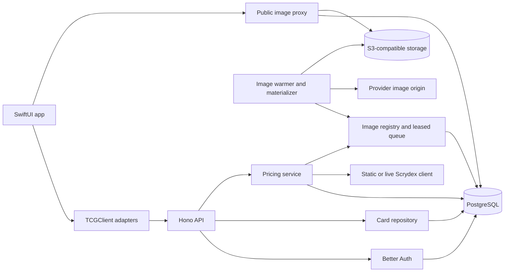

# Architecture

[Back to README](../README.md)

## Repository map

| Path                                  | Responsibility                                                                     |
| ------------------------------------- | ---------------------------------------------------------------------------------- |
| `app/TCG/`, `app/TCG.xcodeproj/`      | Native app entry point, scheme, and test plan                                      |
| `app/Modules/TCGApp/`                 | Scene composition, tabs, feature dependencies, and auth environment                |
| `app/Modules/TCGFeatures/`            | Collection, search, settings, and shared screen snapshot support                   |
| `app/Modules/TCGClient/`              | Generated OpenAPI contract plus handwritten auth, collection, and pricing adapters |
| `app/Modules/TCGDesignSystem/`        | Shared form controls, game picker, toasts, and image loading                       |
| `app/Modules/TCGModels/`, `TCGUtils/` | App-facing game model and shared utilities                                         |
| `server/src/auth/`                    | Better Auth configuration, auth-module integration, and session middleware         |
| `server/src/cards/`                   | User-owned card CRUD, validation, and persistence                                  |
| `server/src/card-pricing/`            | Search, provider normalization, daily caches, and owned-card matching              |
| `server/src/card-images/`, `storage/` | Image registration, durable worker queue, proxy, and S3 access                     |
| `server/src/db/`, `server/drizzle/`   | Drizzle schemas/database connection and committed migrations                       |
| `server/src/logging/`, `exceptions/`  | Request/domain logging and error response handling                                 |
| `server/src/tests/`                   | Integration fixtures and Testcontainers setup                                      |
| `scripts/`, `oxlint-plugins/`         | Worktree/version tooling, simulator lock, and custom lint rules                    |
| `.github/`, `.devcontainer/`          | CI and containerized development                                                   |
| `Dockerfile`, `.dockerignore`         | Production server image and its build context                                      |

## System flow

The app entry point delegates to `TCGScene`, which owns shared auth, collection,
and search state and injects it into SwiftUI. Feature objects use client protocols;
screen models manage presentation state and task scheduling. Preview clients
replace network and credential dependencies for previews and snapshots.

The server entry point constructs `App` and serves it. `App` assembles middleware,
routes, and shared dependencies, starts the image warmer when enabled, and stops
it on shutdown. Tests can inject database, provider, storage, and image dependencies
through the app constructor.

Request middleware establishes the request ID, compression policy, security
headers, logging, and context before routing. `context.ts` supplies dependencies
and request-scoped repositories/services. Routes declare Zod-backed OpenAPI
contracts; handlers coordinate domain work, repositories own database access,
and the exception handler formats failures. The logging middleware records request
outcomes. See [logging](../server/docs/logging.md) for event ownership.

## Authentication and ownership

Better Auth persists users, accounts, sessions, verification data, and signing
keys in PostgreSQL. Email/password auth is enabled without mandatory email
verification. The Hono auth module exposes the app's authentication contract.

The native client stores credentials through KamaalAuth's Keychain store. A
separate session-token client issues JWTs so the normal client's authorization
middleware can refresh credentials without a circular dependency. Collection and
pricing routes require an authenticated session; user-scoped repositories constrain
owned-card access by the authenticated user ID. An inaccessible card is reported
as `CARD_NOT_FOUND`, just like a missing card.

## Persistent data

| Tables                    | Role                                                                                         |
| ------------------------- | -------------------------------------------------------------------------------------------- |
| Better Auth tables        | Accounts, sessions, verification records, and signing keys                                   |
| `card`                    | User ownership, game, identifying fields, notes, and optional provider identity              |
| `card_condition_quantity` | One quantity per condition per owned card; cascades on card deletion                         |
| `card_price`              | Normalized and raw provider data keyed by source, game, provider card ID, and UTC date       |
| `card_price_search`       | Ordered provider IDs for a normalized search, keyed by source, game, query key, and UTC date |
| `card_image`              | Origin/storage mapping, checksum, readiness, attempts, and worker lease state                |

Owned cards are collection entries, separate from provider-priced cards. Create
and update write the owned card and its condition quantities transactionally.
Updates replace the quantity set and clear a saved pricing identity when identifying
fields change. API validation limits quantities and prevents duplicate conditions;
the database also enforces a unique card/condition pair.

Pricing caches are shared across users and separated by provider source. Daily
PostgreSQL advisory locks coordinate equivalent cache misses across instances;
the service rechecks the cache after acquiring a lock. Owned-card matching first
uses a saved provider identity, otherwise searches by name/number and prefers a
matching card number before name. This is heuristic matching, so the returned
price describes the provider's matched base card.

Pricing reads register image origins in the durable image queue. The worker
claims leased jobs, fetches bounded image bytes, stores them in S3, and records
metadata in PostgreSQL. Public proxy URLs derive from a hash of the origin URL;
clients receive the server's image URL rather than the provider origin. Ready
images use immutable caching and ETags. See
[card images](../server/docs/card-images.md) for concurrency and recovery details.

## Contract and validation boundaries

The server route schemas are the API source of truth. `just download-spec`
generates the committed YAML in `TCGClient`; the Swift OpenAPI build plugin generates
transport types. Handwritten client adapters expose app-oriented models, map
status codes and validation issues, and integrate auth. `just check-spec` detects
contract drift.

Server integration tests cross the HTTP handler and real persistence/storage
boundaries. Swift client tests exercise request/response mapping with controlled
transports, feature tests cover state changes, and snapshots cover screen/image
rendering. See [development](development.md#verification-and-ci) and
[app development](../app/README.md) for the corresponding workflows.
